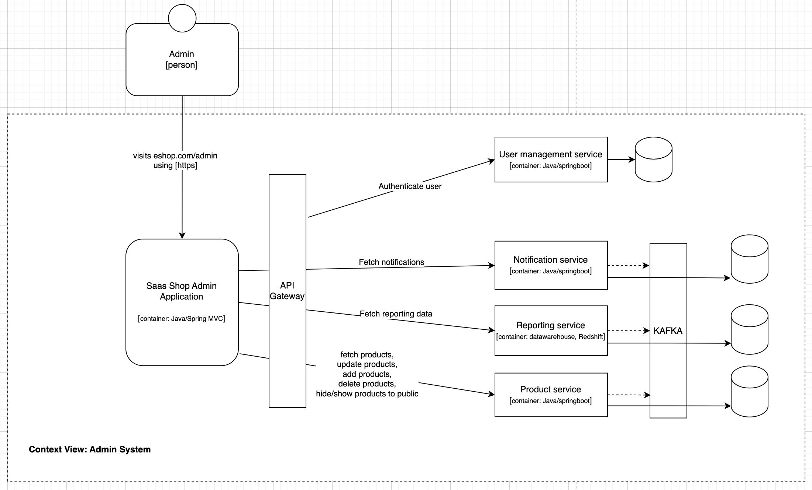
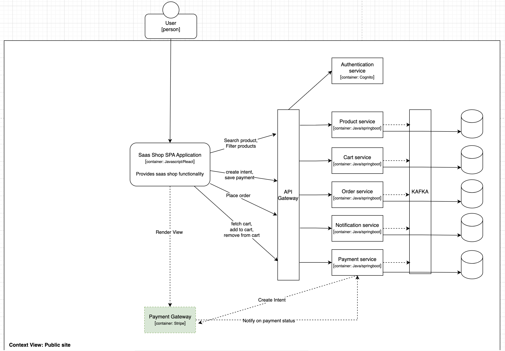
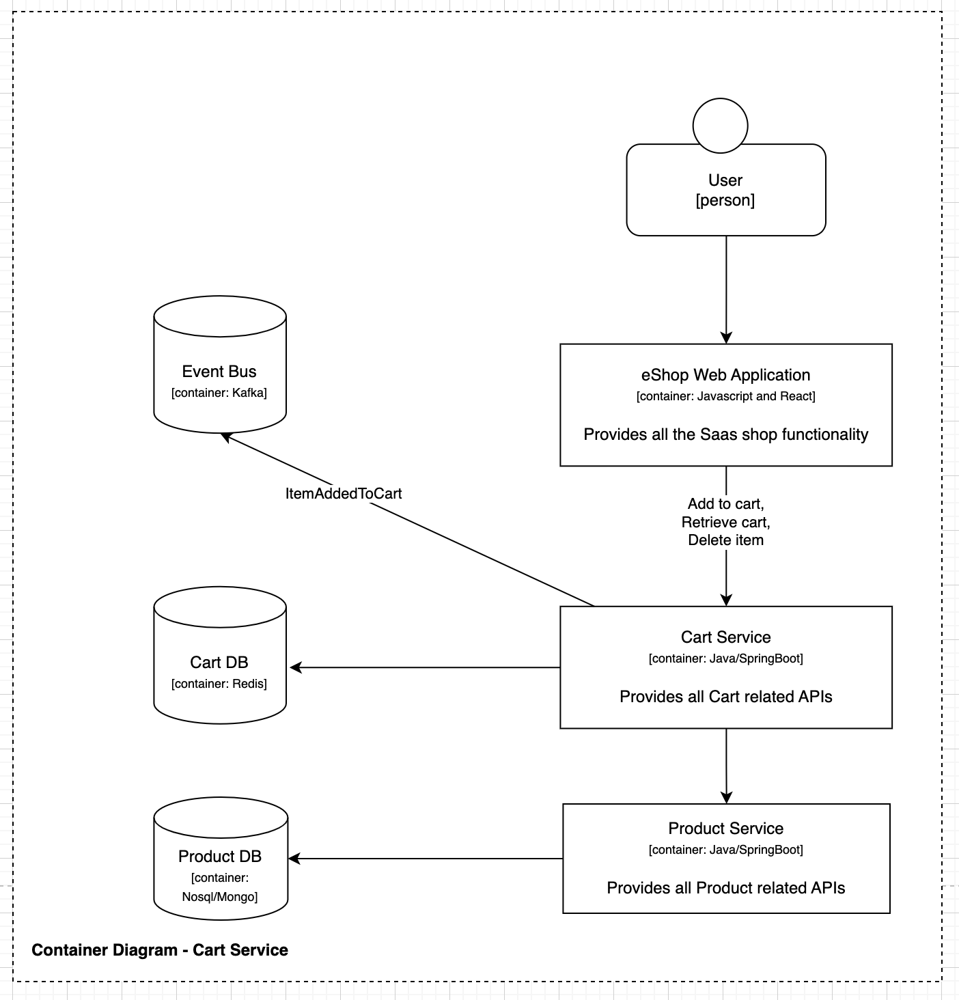
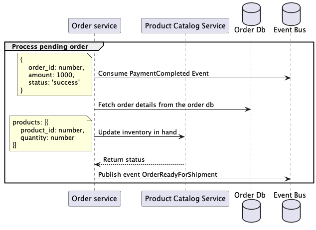

# Summary

Saas has an admin and a public website. The public website is mobile friendly. The admin website is intended to be used by internal employees. The application will use Microservice Architecture.

# Context Diagram

The application has two roles admin, end-customer. The admin have a dedicated admin view which is separate from the public website.

## Admin application context diagram



## Saas shop public site context diagram



# Container Diagram

## Product Service

### Features
- Keyword search of products
- Filter products
- Paginate responses


## Cart Service

### Features
- Add to cart
- Fetch cart
- Remove cart



## Notification Service

### Features
- Deliver email notitifications
- Deliver in-app notifications


## Payment Service

### Features
- Create payment intent
- Emit payment status event
- Store payment details


# Sequence Diagram

## Search filter products


## Add to cart


## Checkout


## Payment integration


## Order



# Non Functional Requirements
- Site should be accessible via desktop and mobile view - This will address by making the website responsive hence, it will give the mobile users a seamless experience. Also, it saves us time and cost.
- Should be able to identify related logs using a trace id / correlation id
- Product search should be able to handle 5000 TPS
- Cart functionality should be able to handle 1000 TPS
- Purchasing functionality should be able to handle 250 TPS

  > We should enable metrics server which will collect resource metrics from kubelet and exposes that information. We can use that information to size our pods, horizontal pod scaling and and cluster scaling if necessary. We can perform a load test with the intended request limits to identify the ideal pod size

  - Set the correct resources for the container as shown below,
    ```json
    spec:
        containers:
            - name: example
            image: example:latest
            resources:
                limits:
                    cpu: 500m
                    memory: 512Mi
                requests:
                    cpu: 200m
                    memory: 256Mi
    ```

  - Setup liveness and readiness probe so that the k8s cluster can hit the actuator health end point and automatically manage in case of unresponsiveness.
    ```json
    livenessProbe:
        httpGet:
            path: /actuator/health/liveness
            port: 8080
        initialDelaySeconds: 30
        periodSeconds: 10
    readinessProbe:
        httpGet:
            path: /actuator/health/readiness
            port: 8080
        initialDelaySeconds: 10
        periodSeconds: 5
    ```

  - Set up Horizontal Pod Autoscaler in the cluster to automatically up/down pods based on CPU or memory utilization
    ```json
    apiVersion: autoscaling/v2beta2
    kind: HorizontalPodAutoscaler
    metadata:
        name: example-hpa
    spec:
        scaleTargetRef:
            apiVersion: apps/v1
            kind: Deployment
            name: example-deployment
        minReplicas: 1
        maxReplicas: 5
    metrics:
        type: Resource
        resource:
        name: memory
        target:
            type: Utilization
            averageUtilization: 70
    ```

## Cross cutting concerns

### Logging and metrics

- All the logs should be aggregated using FluentD/Fluentbit to Elasticsearch and viewable through a Kibana Dashboard
- The health metrics of all the pods should be viewable through a Grafana dashboard

### Security

- CSRF validation
- CORS policy
- https
- MTLS (k8s service to service communication)

## CI / CD

### CI Pipeline

- Each service should have it's own CI pipeline
- The CI pipeline should run with Sonar scan, Owasp dependency checker, unit tests
- The built artifact should be uploaded to a registry (ECR)

### CD Pipeline

- Each service should it's own CD pipeline
- Should be able to deploy a specific version of the build to an environment
- Should be able to reverse deployments
